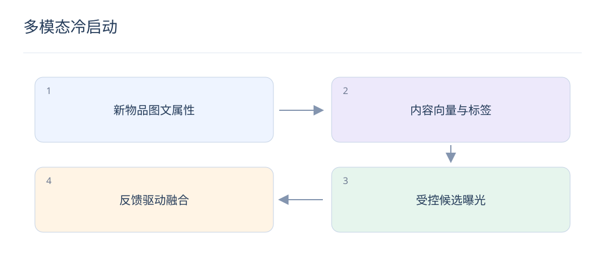

# 多模态冷启动：从内容理解到第一批反馈

> 新物品没有协同历史，但已有标题、图片和属性。内容模型负责建立起点，探索机制负责积累真实偏好。

## 1. 零交互物品可以使用哪些信号？

标题、描述、图片、类目和当时可用的属性都可形成内容表示。不能使用未来销量或后续评论回填新物品评估；发布时间与入库可用时间也应记录。

## 2. 文本和图像怎样融合？

可先归一化并投影到兼容尺度，再拼接、加权或门控。缺图、低质图和标题缺失需要独立掩码与回退，不能让零向量被误认为真实内容。融合方式应与单模态基线比较。

## 3. LLM 提取标签需要什么约束？

固定属性字典与输出 schema，允许“未知”，并用原文证据验证。图片无法可靠判断的材质、功能或尺寸不应强行填入。标签是辅助特征，重要交易属性仍以可信商品数据为准。

## 4. 如何把内容信号接入成熟模型？

可以新增内容召回通道，或训练内容向量向协同空间投影，再随交互积累调整融合权重。拟合成熟物品时要防止只学热门分布，评估必须单独覆盖零交互与低交互物品。

## 5. 为什么相似商品不保证转化？

外观接近还可能有价格、尺寸、售后和库存差异。对“黑色通勤包”，图片召回能找到外观候选，但防水、容量和预算需结构化过滤与排序；不能让视觉分数代替事实约束。

## 6. 第一批曝光怎样分配？

在质量与可用性门槛内保留探索额度，根据用户上下文选择潜在合适人群，并记录实际选择概率。探索不是无差别推送，需控制重复曝光、负反馈和预算，避免伤害体验。

## 7. 如何衡量冷启动效率？

观察首次有效曝光耗时、达到稳定反馈所需曝光量、分阶段 CTR 或满意度及最终覆盖率。比较相同发布时间段与供给类型，并处理尚未成熟的反馈窗口。

## 8. 最容易出现什么实验泄漏？

同一商品的旧版本、相同图片或同款不同 SKU 出现在训练集，会让“新物品”并不真正新。按商品族和内容近重复分组切分，同时报告完全新内容与已有系列新品。

## 延伸阅读

- [CLIP](https://arxiv.org/abs/2103.00020)
- [LinUCB](https://arxiv.org/abs/1003.0146)
