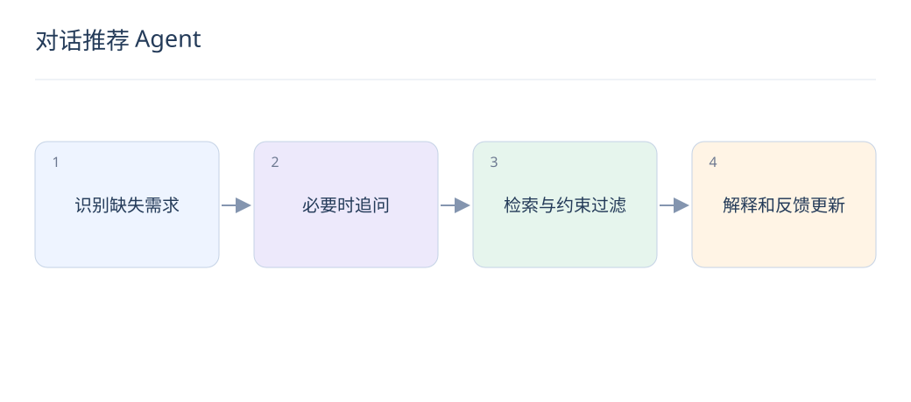

# 对话推荐 Agent：追问、检索与可信解释

> 对话推荐把用户需求逐步变清楚。Agent 应围绕可验证的物品与工具结果工作，让每次追问都减少决策不确定性。

## 1. 什么时候应该追问？

当关键缺失条件会显著改变候选，如预算、使用场景或兼容型号时追问。优先问一个高价值问题，避免机械收集所有字段；若已有足够信息，就给可比较候选并说明依据。

## 2. 对话状态需要保存什么？

保存用户明确约束、偏好强弱、已否定候选和信息来源，区分用户说法与模型推测。用户修改要求时更新状态，而不是把新旧预算同时当硬条件。

## 3. Agent 怎样调用搜索工具？

将自然语言转为校验后的结构化参数，由服务端执行权限、库存和价格过滤。返回有限候选及可信属性，模型负责解释和下一步交互；不要让模型直接编造商品 ID 或绕过过滤。

## 4. 推荐解释怎样避免幻觉？

每条卖点关联实际属性或证据；没有数据就省略或说明未知。“适合你”应对应用户明确需求，不能声称知道未提供的收入、健康状况或个人经历。

## 5. 一个完整对话例子是什么？

用户说“想买通勤耳机”，系统先确认预算和佩戴限制，再检索满足条件的候选。用户补充“不要入耳式”后应删除不合格候选，比较重量、续航等有依据的差异，而非继续推荐原第一名。

## 6. 工具失败怎样处理？

设置超时与有限重试，搜索失败可返回已验证缓存或说明暂时无法取得实时信息。库存和价格过期时标明不确定，不应把语言模型记忆当实时数据继续完成交易建议。

## 7. 怎样评估对话质量？

观察需求解决率、有效追问次数、硬约束违反率、解释事实准确率和用户纠正率。单轮相关性不足以衡量多轮体验；评估集要包含改口、矛盾约束、无匹配结果和工具异常。

## 8. 对话日志如何用于训练？

将用户明确反馈与模型生成内容分开标记，避免自我生成的解释被当真实偏好。对话涉及个人信息时只保留必要字段，遵守用户授权范围，并用时间切分防止同一会话泄漏。

## 延伸阅读

- [RAG](https://arxiv.org/abs/2005.11401)
