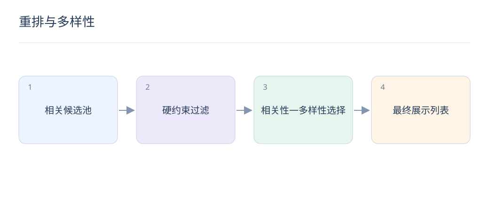
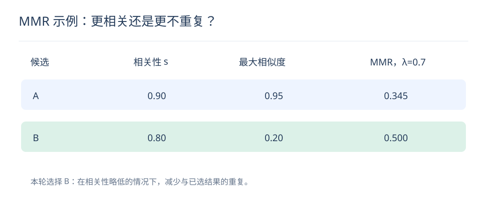

# 重排与多样性：相关之外，怎样组成好列表

> 逐物品高分不保证整页好看。列表需要在相关性、重复、覆盖和业务约束之间做明确取舍。

## 1. MMR 每一步选择什么？

从未选候选中挑选综合得分最高的物品：奖励与请求相关，惩罚与已选集合 S 的最大相似度。首个物品可令冗余项为零。它是贪心启发式，不保证所有列表目标的全局最优。

## 2. λ 怎样影响结果？

λ 越大越偏向相关性，越小越强调不同。两项分数尺度需可比较，否则权重没有直观意义；应在满足相关性门槛的候选中调节，而不是用无关内容制造表面多样性。

$$
\mathrm{MMR}(i)=\lambda s(i)-(1-\lambda)\max_{j\in S}\mathrm{sim}(i,j)
$$

## 3. 去重与多样性有什么区别？

去重排除同 ID、同款或近重复素材，多样性考虑类目、主题、作者等覆盖。先做基本去重，再优化软多样性，能避免模型花大量预算区分本质重复的候选。

## 4. 硬约束应放在哪里？

权限、库存、黑名单和明确频控必须由确定性规则执行。类目覆盖、作者分散等可按业务定义为硬约束或软目标，但应设无可行解时的降级顺序，不能静默违反关键约束。

## 5. 一个 MMR 计算例子是什么？

λ=0.7，候选 A 相关分0.9、与已选最大相似度0.95，得分0.345；B 相关分0.8、相似度0.2，得分0.5，因此这一步选 B。前提是两种分数已在合理尺度上。

## 6. 怎样评价列表而非单物品？

结合 NDCG、列表内相似度、类目覆盖、重复率与用户满意度。多样性指标上升同时相关性下降时，需要看实际体验，而非把任一指标单独当最终目标。

## 7. LLM 可用于列表重排吗？

可评价语义重复或约束覆盖，但须限制候选 ID、检查遗漏与重复，并控制列表长度与超时。LLM 分数不自动可校准，优先与确定性重排基线比较增益和成本。

## 8. 为什么训练与展示列表要一致？

如果线上经过大量规则改变次序，训练时的预测列表与用户实际看到的列表就不同。日志应保存最终位置、过滤原因和策略版本，离线复盘应按最终展示恢复上下文。

## 延伸阅读

- [搜索结果多样化研究](https://www.microsoft.com/en-us/research/wp-content/uploads/2009/02/diversifying-wsdm09.pdf)
