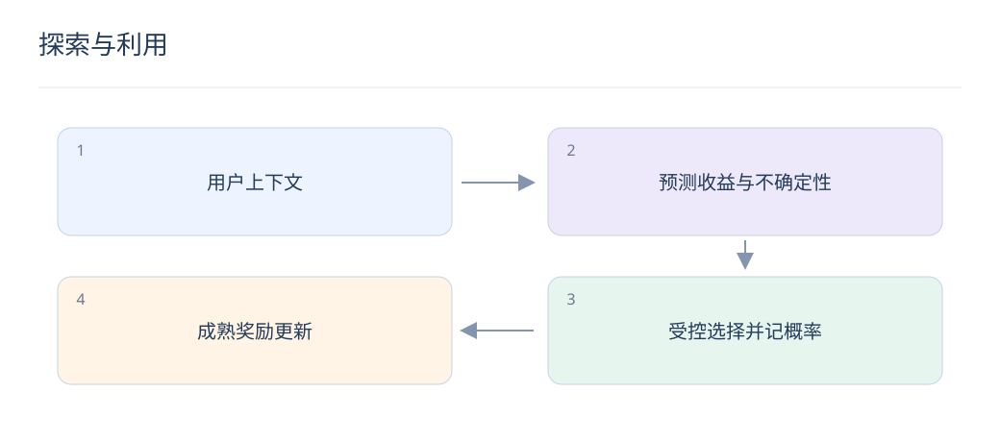

# 探索与利用：从随机流量到上下文 Bandit

> 只推荐当前最有把握的内容，会一直缺少新内容的反馈。探索要有预算、有记录，并与业务风险相匹配。

## 1. 探索与随机推荐相同吗？

探索是为了减少不确定性而有计划地展示候选，随机选择只是方法之一。应先保证质量与可用性，再在受控集合内探索；无差别向用户展示低质量内容并不合理。

## 2. ε-greedy 如何工作？

以 1−ε 的概率选当前最佳动作，以 ε 的概率按约定分布探索。记录的选择概率要包含两条路径：最佳动作也可能在随机分支被选中，不能简单将它的概率记为 1−ε。

$$
\mathrm{UCB}(x)=x^T\hat\theta+\alpha\sqrt{x^T A^{-1}x}
$$

## 3. UCB 为什么奖励不确定性？

线性上下文示意中，预测均值加置信上界奖励；A 汇总特征观测，α 控制探索程度。公式适用性依赖模型和噪声假设，实际系统需检验不确定性估计是否可靠。

## 4. Thompson Sampling 的直觉是什么？

从参数后验中采样，再选该样本下预测最佳动作，使不确定但有潜力的候选获得机会。后验模型若严重失配，探索分配也会失真；不能把任意加噪声都称为正确的后验采样。

## 5. 如何计算 ε-greedy 的概率？

四个候选、ε=0.2、探索均匀随机且最佳项唯一时，最佳项选择概率为0.8+0.2/4=0.85，其余每项为0.05。该概率应随请求候选集合记录，便于之后离线估计。

## 6. 延迟奖励怎样处理？

点击可很快观察，购买或长期留存可能延迟。不能把尚未返回的奖励直接视为零；维护待成熟样本、固定窗口，并避免短期信号把探索策略持续拉向即时但低质量反馈。

## 7. 与强化学习有什么区别？

上下文 Bandit 主要优化当前动作的奖励，通常不显式建模动作如何改变未来状态；强化学习考虑长期状态转移。若推荐影响长期兴趣，Bandit 是简化，不应声称已解决长期最优。

## 8. 上线需要哪些保护？

限制探索比例、重复曝光和低质内容，记录候选、实际概率与奖励口径。分别观察新物品学习速度和用户体验护栏；策略持续自适应时，实验推断也应考虑非固定流量机制。

## 延伸阅读

- [LinUCB](https://arxiv.org/abs/1003.0146)
