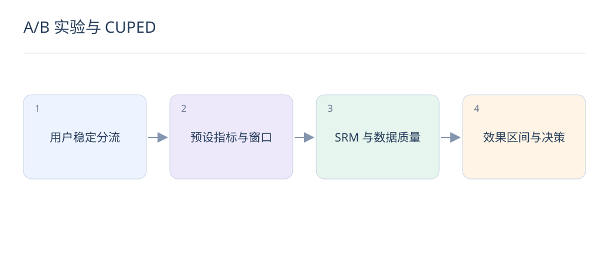

# A/B 实验与 CUPED：判断提升是否可信

> 线上实验先确保分流与指标正确，再解释显著性。统计方法不能修复串组、漏日志和错误归因。

## 1. 为什么常按用户稳定分组？

同一用户跨请求进入不同组，会相互污染体验与行为反馈。按用户哈希稳定分流更适合用户体验实验；存在社交或供给干扰时，可能需更高层级随机化，统计单位要与分流一致。

## 2. 实验前应确定什么？

预设主指标、护栏、最小可检测效应、样本量与运行窗口。点击、转化和留存需统一分母与归因口径；不要等结果出现后再挑最显著的指标当主目标。

$$
Y_{\mathrm{adj}}=Y-\theta(X-\bar X),\qquad \theta=\frac{\mathrm{Cov}(Y,X)}{\mathrm{Var}(X)}
$$

## 3. SRM 表示什么？

样本比例与预期分流比例不符，是分流、资格过滤、日志或流失等问题的警报。先检查随机化入口与后续过滤，不能看到显著收益就忽略 SRM；修复前因果结论可能不可信。

## 4. CUPED 使用什么信息？

用实验前、不会被实验处理影响且与结果相关的协变量 X，调整结果 Y 以减少方差。公式为常见线性形式；X 缺失、相关性弱或新用户占比高时，收益可能有限。

## 5. CUPED 会人为制造提升吗？

规范使用实验前协变量旨在降噪，而非放大均值差。若把实验期间受处理影响的点击作为 X，可能消除或扭曲真实效果。应保持估计和置信区间计算与随机化单位一致。

## 6. 为什么不能每天看 p 值就随时停？

反复查看后只在显著时停止会改变错误率。应遵守预设固定窗口，或使用合适的序贯方法；业务护栏触发紧急回滚是另一回事，不应与宣布收益混为一谈。

## 7. 怎样解释显著与不显著？

显著不等于收益大，不显著不等于两组相同。报告绝对差、相对差和置信区间，结合业务价值与成本；区间仍涵盖重要损失时，不能宣称安全无影响。

## 8. 模型实验需额外观察什么？

检查延迟、超时、无结果率、负反馈、供给集中与新用户切片。若 CTR 增加但长期满意度下降，需分析目标偏移；共享库存或创作者供给也可能使两组互相影响。

## 延伸阅读

- [SRM 诊断](https://www.microsoft.com/en-us/research/publication/diagnosing-sample-ratio-mismatch-in-online-controlled-experiments-a-taxonomy-and-rules-of-thumb-for-practitioners/)
- [CUPED 方差缩减](https://www.microsoft.com/en-us/research/articles/deep-dive-into-variance-reduction/)
