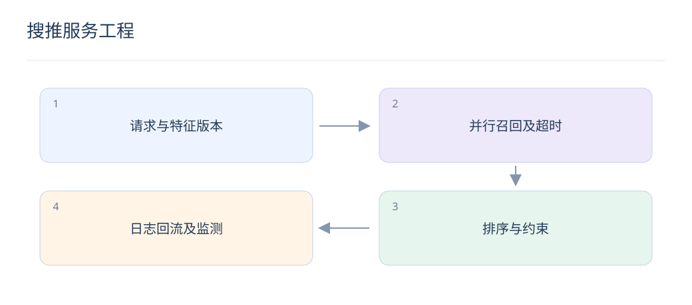

# 搜推服务工程：特征、索引、延迟与回滚

> 模型只是一条在线链路中的一个环节。可靠上线需要让数据、模型和索引一起对齐，并在异常时返回有效结果。

## 1. 为什么要监控整条链路？

特征慢、某路召回超时或日志漏报都可能让模型效果失真。为同一 request_id 记录各阶段耗时、候选数、降级状态和版本，才能区分模型质量与基础设施问题。

## 2. 端到端延迟怎样分配？

串行阶段延迟相加，并行阶段主要受关键路径影响，还要加排队和合并成本。给特征、召回、排序和 LLM 调用分别设预算，重点测真实并发下的 P95/P99，而不是孤立平均耗时。

## 3. 离在线特征一致性怎样保证？

统一字段定义、默认值、变换逻辑和时间窗口，通过请求回放逐字段比较。训练用历史快照，线上用请求时可见值；只共用代码仍不能避免底层数据更新延迟不同。

## 4. 哪些版本必须绑定？

向量召回至少绑定 tokenizer、模型、归一化方式和索引；排序还需特征 schema 与校准版本。发布清单应能定位到同一套兼容产物，禁止随意混搭“最新模型”和“旧索引”。

## 5. 如何设计降级路径？

某路召回超时可使用其他路；LLM 重排失败可回退轻量重排；特征缺失用明确默认值。降级结果仍必须经过权限、库存和去重规则，不能为可用性绕开硬约束。

## 6. 影子流量和灰度有什么区别？

影子流量执行新链路但不影响用户展示，适合比较耗时、错误和候选差异；灰度真正让部分用户使用新结果，可验证实际反馈。影子无法证明在线收益，灰度需实验与回滚标准。

## 7. 缓存会带来哪些隐患？

缓存键缺少用户、约束或版本可能返回错误结果，长 TTL 可能展示下架物品。缓存命中后仍检查必须实时生效的限制，并分别监控命中率、陈旧率和跨版本兼容性。

## 8. 如何完成一次可回滚发布？

先校验产物和离线回放，再影子与小流量，观察指标后逐步扩量。保留上一套模型、索引和配置，使用原子指针或路由切换；回滚后核验实际生效版本，而不是只看发布命令成功。

## 延伸阅读

- [Faiss 索引](https://github.com/facebookresearch/faiss/wiki/Faiss-indexes)
- [YouTube 推荐系统](https://research.google/pubs/deep-neural-networks-for-youtube-recommendations/)
