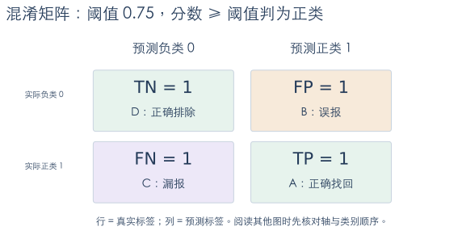
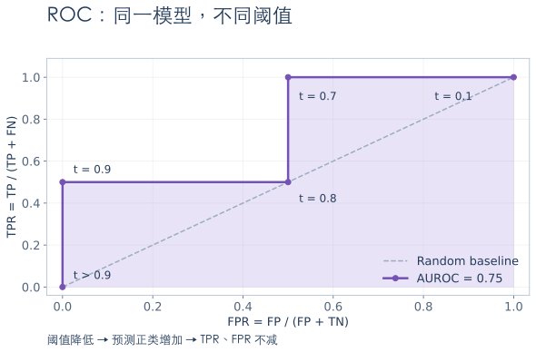
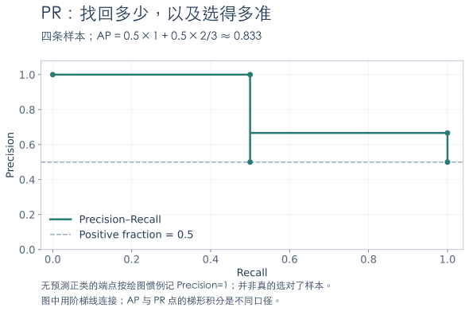

# 混淆矩阵、ROC 与 AUROC：读懂分类评估

> 混淆矩阵看一个阈值下分对了多少；ROC 看阈值变化时的取舍；AUROC 概括正负样本的排序能力。三者有关联，但回答的问题不同。

## 1. 从分数到预测标签

以点击预测为例：实际点击是正类 `1`，未点击是负类 `0`。模型先给出分数，再通过阈值变成标签：**分数 ≥ 阈值，预测为正类**。

下面四条样本贯穿全文。分数越高，表示模型越倾向于正类；它不一定是校准后的概率。

| 样本 | 实际标签 | 模型分数 | 阈值 0.75 时的预测 |
|---|---:|---:|---:|
| A | 1 | 0.9 | 1 |
| B | 0 | 0.8 | 1 |
| C | 1 | 0.7 | 0 |
| D | 0 | 0.1 | 0 |

## 2. 混淆矩阵：先认清行列

本文约定：**行是真实标签，列是预测标签，负类在前**，与 `confusion_matrix(..., labels=[0, 1])` 一致。



- **TP，真正例**：实际为正，预测也为正，如 A。
- **FP，假正例**：实际为负，却预测为正，如 B，也叫误报。
- **FN，假负例**：实际为正，却预测为负，如 C，也叫漏报。
- **TN，真负例**：实际为负，预测也为负，如 D。

记忆方法：T／F 表示预测是否正确，P／N 表示**预测的类别**。有些图会交换行列或类别顺序，阅读时先看轴标签。[混淆矩阵接口说明](https://scikit-learn.org/stable/modules/generated/sklearn.metrics.confusion_matrix.html)

## 3. Accuracy、Precision、Recall 与 F1

| 指标 | 公式 | 它回答什么？ |
|---|---|---|
| Accuracy，准确率 | $(TP+TN)/(TP+FP+FN+TN)$ | 全部样本中，预测正确的比例 |
| Precision，精确率 | $TP/(TP+FP)$ | 预测为正的样本中，有多少真是正类 |
| Recall，召回率／TPR | $TP/(TP+FN)$ | 实际正类中，找回了多少 |
| FPR，假正例率 | $FP/(FP+TN)$ | 实际负类中，有多少被误报 |
| Specificity，特异度 | $TN/(TN+FP)=1-FPR$ | 实际负类中，正确排除了多少 |
| F1 | $2TP/(2TP+FP+FN)$ | Precision 与 Recall 的调和平均 |

**Precision 的分母是预测正类；Recall 的分母是真实正类；FPR 的分母是真实负类。** FPR 不是 $1-Precision$。

上例四格都是 1，因此 Accuracy、Precision、Recall、FPR 和 F1 都为 0.5。阈值降到 0.7 后，C 被找回：TP=2、FP=1、FN=0、TN=1；Precision=2/3，Recall=1，F1=0.8。

分母为零时，指标没有对应的比例含义，应明确记为未定义还是按约定赋值；不要在实验间悄悄改变处理方式。

## 4. ROC：每个阈值对应一个点

ROC 的横轴是 **FPR**，纵轴是 **TPR（Recall）**。降低阈值，更多样本被判为正，TP 和 FP 都不会减少，因此曲线逐步向右上方移动。Precision 则不保证单调变化。

| 阈值 t，分数 ≥ t 判正 | TP | FP | FPR | TPR |
|---|---:|---:|---:|---:|
| 高于 0.9 | 0 | 0 | 0 | 0 |
| 0.9 | 1 | 0 | 0 | 0.5 |
| 0.8 | 1 | 1 | 0.5 | 0.5 |
| 0.7 | 2 | 1 | 0.5 | 1 |
| 0.1 | 2 | 2 | 1 | 1 |



越接近左上角，代表在较低误报率下找回更多正类。对角线是无区分能力的随机基准的期望表现，有限样本的随机曲线不一定恰好落在对角线上。

同分样本应作为一组一起跨过阈值，不能随意拆开排序来“提高”面积。[ROC 曲线接口说明](https://scikit-learn.org/stable/modules/generated/sklearn.metrics.roc_curve.html)

## 5. AUROC：正例能否排在负例前面？

AUROC 与 ROC-AUC 是同一个指标，即 ROC 曲线下面积。单说 AUC 时应说明是哪条曲线。

对于无样本权重的二分类数据，它也等于：随机取一对正负样本，正例得分更高的比例；平分算半次正确。

$$
\mathrm{AUROC}=\frac{1}{N_+N_-}\sum_{i:y_i=1}\sum_{j:y_j=0}\left[\mathbf{1}(s_i>s_j)+\tfrac12\mathbf{1}(s_i=s_j)\right]
$$

上例正类分数为 `[0.9, 0.7]`，负类分数为 `[0.8, 0.1]`。四次比较中赢了三次，因此 **AUROC=3/4=0.75**，也与图中面积一致。

- 1：这批样本中所有正例都排在负例前。
- 0.5：整体成对区分能力相当于随机；不代表每个阈值都一样差。
- 小于 0.5：先检查正类定义、分数方向和数据问题，不要直接在测试集上翻转分数来选模型。

AUROC 不依赖单个分类阈值；严格单调递增的分数变换不会改变它。但它**不衡量概率校准，也不自动保证 Top-K 或线上效果好**。只有一个类别时，AUROC 无法定义。[AUROC 接口说明](https://scikit-learn.org/stable/modules/generated/sklearn.metrics.roc_auc_score.html)

## 6. 类别不平衡：还要看 PR 曲线

假设 10,000 次曝光中只有 100 次点击。全部预测“不点击”，Accuracy 仍为 99%，但 Recall 为 0。

即使 TPR=80%、FPR=1%，也有 TP=80、FP=99，Precision 只有 $80/(80+99)\approx44.7\%$。**很小的误报率，也可能对应很多误报。**

PR 曲线以 Recall 为横轴、Precision 为纵轴，更直接展示“找回多少正类”和“选出的结果有多准”。



AP（Average Precision）常用各次 Recall 增量对 Precision 加权。上例 AP 为 $0.5\times1+0.5\times(2/3)=5/6\approx0.833$。

AP **不等于**对 PR 点做梯形积分得到的面积，报告时要注明计算方式。正类比例变化会明显影响 Precision／PR；若类条件分数分布保持不变，ROC 理论上不随正类比例改变，但真实业务中的分布漂移仍会改变 ROC。[AP 接口说明](https://scikit-learn.org/stable/modules/generated/sklearn.metrics.average_precision_score.html)

## 7. 用代码核对

```python
import numpy as np
from sklearn.metrics import (
    confusion_matrix, precision_score, recall_score,
    f1_score, roc_curve, roc_auc_score, average_precision_score,
)

y = np.array([1, 0, 1, 0])
score = np.array([0.9, 0.8, 0.7, 0.1])
pred = (score >= 0.75).astype(int)

assert confusion_matrix(y, pred, labels=[0, 1]).tolist() == [[1, 1], [1, 1]]
assert precision_score(y, pred) == recall_score(y, pred) == f1_score(y, pred) == 0.5
assert np.isclose(roc_auc_score(y, score), 0.75)
assert np.isclose(average_precision_score(y, score), 5 / 6)
fpr, tpr, thresholds = roc_curve(y, score, drop_intermediate=False)
```

计算 ROC／AUROC 时传入**正类分数**，不要传入已经阈值化的 0／1 预测，否则会丢失排序信息。使用 `predict_proba` 时，先检查 `model.classes_`，确认哪一列对应业务正类。

## 8. 在搜推任务里怎样选指标？

| 目标 | 优先观察 |
|---|---|
| 固定阈值筛选 | 混淆矩阵、Precision、Recall、误报与漏报成本 |
| 整体二分类区分能力 | AUROC，并检查用户或请求分组 |
| 正类稀少、关注选中质量 | PR 曲线、AP、目标 Recall 下的 Precision |
| 只展示前 K 个结果 | Recall@K、NDCG@K 等列表指标 |
| 用概率计算期望收益 | Logloss、Brier score、校准情况 |

阈值应在验证集上依据业务成本或约束选择，再在独立测试集上报告。0.5 不是默认最优阈值，AUROC 也不会替你选阈值。

搜推中的全局 AUC 会比较不同用户的样本，可能掩盖用户内排序问题。若使用 GAUC，应说明分组、权重和单一类别组的处理；仍需结合 Top-K 指标和线上实验。

继续阅读：[概率校准](/basics/search-rec-esmm-calibration) · [A/B 实验](/basics/search-rec-ab-cuped)
