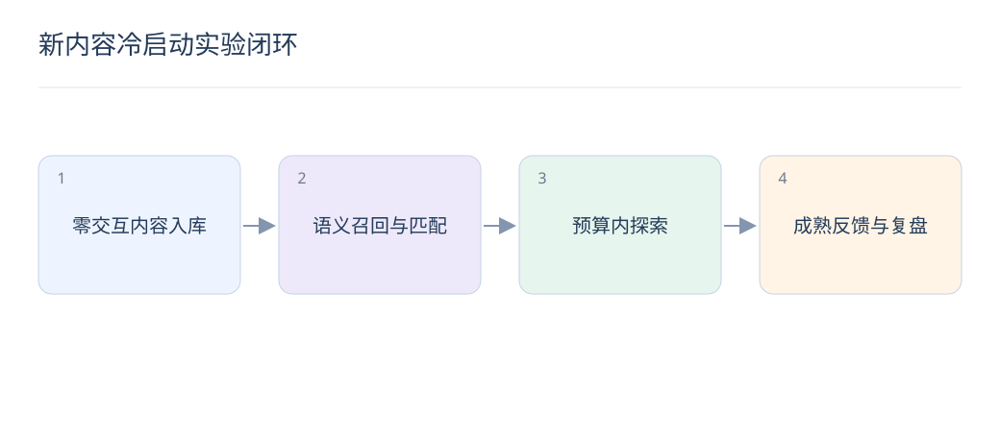

# 项目设计：新内容冷启动实验闭环

> 冷启动项目要证明新内容更快获得有效反馈，同时保持用户体验。把“进入候选”与“获得真实收益”分开衡量。

## 1. 项目目标怎样定义？

给出新内容的时间和交互阈值定义，例如发布后一定窗口内且交互很少，但阈值应按业务决定。目标可以是缩短首次有效曝光时间，同时限制负反馈和体验损失。

## 2. 如何建立数据集？

按发布时间构建未来新品测试集，训练只用此前可见内容和行为。去除同素材、同商品族泄漏，区分完全新主题和已有系列新品，并等待评估标签窗口成熟。

## 3. 第一版模型选什么？

用文本、图像和结构化属性建立内容向量，与成熟物品行为向量或用户兴趣匹配。先做单模态和简单融合基线，再尝试 LLM 标签，避免多模块同时变化使收益不可归因。

## 4. 探索如何控制风险？

只让通过质量门槛的内容参与，限制每用户和每物品曝光，匹配相关兴趣人群。记录每次选择概率及未入选原因，以便评估策略覆盖；不要拿随机噪声内容测试用户耐心。

## 5. 如何判断模型偏爱热门类目？

按类目供给量、发布时间和曝光预算比较覆盖与有效反馈，检查小众主题是否始终得不到机会。总体点击提升可能只是把资源重新集中到热门类目，需要结合分组结果解释。

## 6. 从冷启动到成熟如何切换？

随着可靠交互累积，逐步提高协同信号权重，不必在单一阈值突然切换。检查阈值附近排序稳定性、重复曝光和反馈成熟度，避免少量偶然点击造成过度放大。

## 7. 实验怎样避免供给相互干扰？

同一新内容在两组共享曝光与热度时可能产生干扰，应明确随机化单位，必要时按供给或集群设计。不能把跨组共同更新的热度当作完全独立处理，需在报告中解释限制。

## 8. 最终报告应该包含什么？

呈现首次有效反馈时间、覆盖率、成熟后质量、用户护栏、计算成本和失败切片；说明数据窗口及不确定性。保留未改善的类目和假设，给出下一步验证，而不是只展示最好看的总体数字。

## 延伸阅读

- [CLIP](https://arxiv.org/abs/2103.00020)
- [LinUCB](https://arxiv.org/abs/1003.0146)
