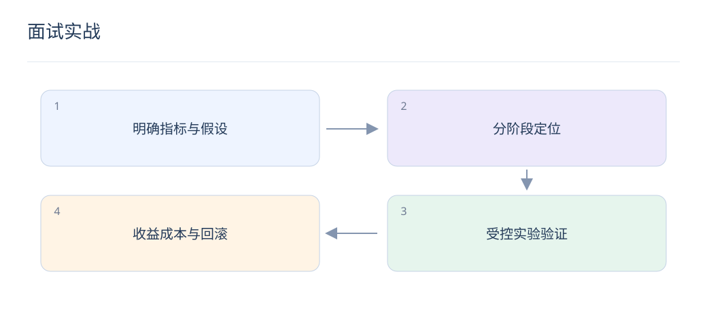

# 面试实战：指标计算、故障定位与方案取舍

> 回答搜推问题时，把定义、计算和证据连起来。能解释一个失败请求，通常比背更多模型缩写更有说服力。



## 1. Recall@K 与 Precision@K 怎么算？

对单个请求，Recall 是前 K 中相关数量除以全部标注相关数量，Precision 是前 K 中相关数量除以 K。若相关集合为 {A,C,D}、前二为 [A,B]，两者分别为 1/3 和 1/2；零相关样本需约定口径。

## 2. 为什么离线 AUC 涨、线上不涨？

先检查时间泄漏、候选分布、特征一致性、服务降级和实验可信度，再分析指标与目标错位。AUC 衡量整体相对次序，未必反映前几位列表、概率校准或实际业务收益。

## 3. 如何定位召回率突然下降？

沿目录可用性、过滤条件、请求特征、模型向量、索引版本和 ANN 参数逐层比较。用同一请求做精确检索：若精确结果好而 ANN 差，优先查索引；两者都差再查表示和数据。

## 4. 如何回答延迟必须减半？

先用分阶段耗时与并发压测定位关键路径，再讨论缓存、并行、候选规模、小模型蒸馏或索引参数。每项优化同时记录质量损失与资源变化，不能承诺单纯缩候选完全不损失效果。

## 5. 一道概率题怎样避免重复相乘？

若 CTR=0.2、点击后 CVR=0.1，曝光到点击且转化概率为0.02。若模型直接给出 CTCVR=0.02，就无需再乘 CTR；先说明条件空间，再写收益公式。

## 6. 如何设计一个能证伪的实验？

提出明确假设，如“口语 Query 缺少字面重叠导致漏召回”，固定排序和数据，只新增语义通道，观察该切片候选覆盖。若覆盖不变，即使总体指标变化，也不能据此确认原假设。

## 7. 项目数字记不清时怎么办？

说明已确认的实验方向、指标定义和验证方式，不编造提升百分比。可用明确标注的假设数值做计算演示，同时区分设计容量与压测实测值。

## 8. 怎样组织三分钟项目介绍？

先说业务失败案例和目标，再说明数据与基线、关键改动、实验结果及限制，最后解释成本和回滚。优先讲自己能验证的因果链；如果有多个改动，应说明消融如何拆分贡献。

## 动手计算

下面只演示单请求指标；真实评估还应明确去重、无相关标签和不足 K 个结果的口径。

```python
def recall_precision_at_k(ranked_ids, relevant_ids, k):
    if k <= 0:
        raise ValueError("k must be positive")
    if len(ranked_ids) != len(set(ranked_ids)):
        raise ValueError("ranked IDs must be unique")
    relevant = set(relevant_ids)
    hits = len(set(ranked_ids[:k]) & relevant)
    recall = hits / len(relevant) if relevant else None
    return recall, hits / k

assert recall_precision_at_k(["A", "B"], {"A", "C", "D"}, 2) == (1/3, 1/2)
```

## 延伸阅读

- [Faiss 索引](https://github.com/facebookresearch/faiss/wiki/Faiss-indexes)
- [SRM 诊断](https://www.microsoft.com/en-us/research/publication/diagnosing-sample-ratio-mismatch-in-online-controlled-experiments-a-taxonomy-and-rules-of-thumb-for-practitioners/)
